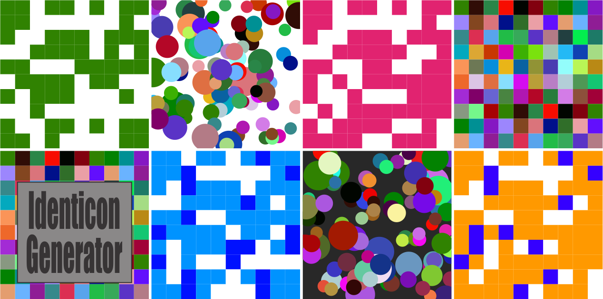
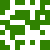
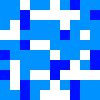
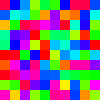

# IdenticonGenerator
A lite weight tool for generating Identicons in Java and Groovy.

### A what?
  An [Identicon](https://en.wikipedia.org/wiki/Identicon) is a visual representation of a hash value, usually of an IP address, that serves to identify a user of a computer system as a form of avatar while protecting the users' privacy. The original Identicon was a 9-block graphic, and the representation has been extended to other graphic forms by third parties.

  Note: Some of the patterns are using randomization to ensure an interesting pattern while Patchwork, & Dots are derived from the hex value from a public Key.


## A Few Samples
| DOTS | Patchwork | Monochrome | Trichrome | Random|
|------|-----------|------------|-----------|-------|
 |  |  |  | 

## Getting Started

### Gradle
#### Add Jcenter to your repos if your not already using it.
 ```
repositories {
    mavenCentral()
    jCenter()
}
 ```
#### Import Identicon Generator into your project from JCenter Note:
```
implementation 'org.meadowhawk:IdenticonGenerator:1.0.0'
```
### Maven
#### Add to your pom
```
<dependency>
	<groupId>org.meadowhawk</groupId>
	<artifactId>IdenticonGenerator</artifactId>
	<version>1.0.0</version>
	<type>pom</type>
</dependency>
```

### Code Examples
The interface is intended to be easy to use so all calls can be made on the static methods in [IdenticonGenerator.groovy](./src/main/groovy/org/meadowhawk/identicon/IdenticonGenerator.groovy) Unless you want to do something that isn't already coded, this is all you have to do!

#### Write a little Code to create an Identicon in a file!
```
IdenticonGenerator.generateToFile("TRICHROME", "TEST.SVG")
```

#### Want more control where the image goes? Just get an OutputStream so you can do what you want with it later
```
StringWriter out = IdenticonGenerator.generate("TheByteArrayFromaUserNameOrPublickKey".getBytes(), Pattern.TRICHROME, IconSize.REGULAR)

```
There are quire a few other static methods available to call, take a look at IdenticonGenerator for more.

### More Stuff

#### Unique Seeds
To ensure that the users get unique Identicons you can base them of a byte array generated from their unique id. There are a few ways to generate this byte array:
1. User their Public Key: (This is what the no byte array method do but using a randomly generated Key. of corse its better to use an actual public key)  ``` KeyPair.getPublic().encoded ```  see. [Helper.groovy](./src/main/groovy/org/meadowhawk/identicon/util/Helper.groovy) for an example.

2. Use the Users Id  and add on their ip address (must be >= 20 chars) ``` "lees2bytes@188.192.9.109".getBytes()```
3. User their email address; really any unique identifier will work, just make sure its on the longer side (50+ chars  is nice) or the uniqueness wills suffer.


#### Patterns
There are a number of Patterns that can be provided to give the Identicon a unique looks. Some are based entirely off the seed byte array and others have varying degrees of randomness in them just to amp up the interest level. 

* PATCHWORK - Seeded from byte array, provides a nifty patchwork look when using a users public key.
* MONOCHROME - Seeded from the 42nd - 44th bytes in the seed, it provides a single color on a white background similar to the gitHub Identicon.
* TRICHROME - Seeded Randomly, it provides 2 colors on a white background similar to MONOCHROME.
* DOTS - Seeded from byte array, it randomly throws varying sized dots on a dark or light background. 
* MIRRORED - Based on part of the seed then mirrored (TBD)
* RANDOM - Comes out a lot like Patchwork but the colors are randomly selected. Not based on seed and probably less unique?

### Want to help?
Dive on in or give me a shout! There's a few issues below that need work and I'm open to any expansions etc.

### TODOs
- [ ] Reactor the Pattern Enum into a base class. Including closures in an enum was pretty amazing but this would benefit from a default class that can be overridden and allow for more patterns to be created without messing with an enum thats getting kinda ugly/
- [x] Allow for icon size changes, default is currently 100x100
- [ ] Refine Hex to color algorithm
- [x] Make TRICHROME based off seed.